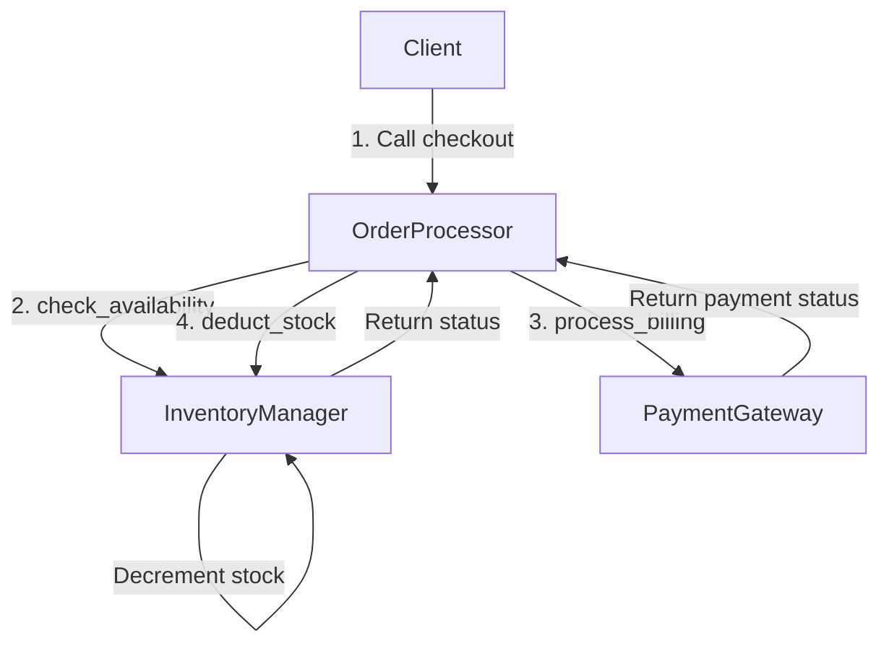

# Code Analysis Report: Test/app.py

## High-Level Intent
The module `./Test/app.py` implements a simple, simulated e-commerce order processing system. It coordinates inventory management (`InventoryManager`) and payment processing (`PaymentGateway`) via a central orchestrator class (`OrderProcessor`).

---

## Structural Workflow
The system components interact in a sequential manner during the checkout process:


---

## Detailed Implementation
- **`InventoryManager`**: Manages a local stock dictionary.
  - `check_availability(item_id)`: Checks if the item exists and its count > 0.
  - `deduct_stock(item_id)`: Deducts 1 unit of stock if `check_availability` returns true.
- **`PaymentGateway`**: Simulates payment processing.
  - `process_billing(user_id, amount)`: Validates that the amount is positive. Returns success/failure.
- **`OrderProcessor`**: Orchestrates checkout.
  - `checkout(user_id, item_id, price)`: Executes check stock -> bill user -> deduct stock. Returns status string.

---

## Health/Impact Summary
**Status: WARNING (Medium Risk)**

- **Cyclomatic Complexity**: Low (Max 3 for `checkout`). Easy to maintain and read.
- **High Coupling**: High. `OrderProcessor` instantiates its dependencies (`InventoryManager` and `PaymentGateway`) directly in its `__init__` constructor.
- **Race Condition Vulnerability**: High. The check-then-act pattern in `checkout` and `deduct_stock` is not thread-safe.

---

## Key Findings & Diagnostics
1. **God Nodes / High Fan-In**:
   - `check_availability` has an In-degree of 2. It is called by `OrderProcessor.checkout` and internally by `InventoryManager.deduct_stock`. Any changes to its signature will propagate to multiple callers.
2. **Hardcoded Dependencies**:
   - `OrderProcessor` cannot be easily unit-tested in isolation because it tightly couples to the concrete implementations of `InventoryManager` and `PaymentGateway`.
3. **Double Check / Redundancy**:
   - `OrderProcessor.checkout` calls `check_availability`, and then `InventoryManager.deduct_stock` calls `check_availability` again. This redundant check is inefficient and highlights lack of coordination.

---

## Remediation Plan
1. **Apply Dependency Injection**:
   Modify `OrderProcessor` to accept dependencies via constructor injection:
   ```python
   class OrderProcessor:
       def __init__(self, inventory: InventoryManager, payment: PaymentGateway):
           self.inventory = inventory
           self.payment = payment
   ```
2. **Ensure Thread Safety**:
   Use mutex locks or atomic transactions to prevent race conditions during concurrent checkouts where stock is limited.
3. **Consolidate Stock Verification**:
   Let `deduct_stock` return a boolean indicating success of deduction, preventing double-checking.

---

## Visualization Link
> [!IMPORTANT]
> To prevent connection errors, you MUST start the local visualization server first before opening the flowchart link.
> **Command to start the server:** `uv run python -m codegraphcontext visualize` (or `cgc visualize` inside the virtual environment).

[Interactive Flowchart Graph Query](http://localhost:8000/index.html?cypher_query=MATCH%20%28f%3AFile%20%7Bname%3A%20%22app.py%22%7D%29-%5B%3ACONTAINS%2A1..2%5D-%3E%28n%29%20OPTIONAL%20MATCH%20%28n%29-%5Br%3ACALLS%5D-%3E%28m%29%20RETURN%20f%2C%20n%2C%20r%2C%20m)
